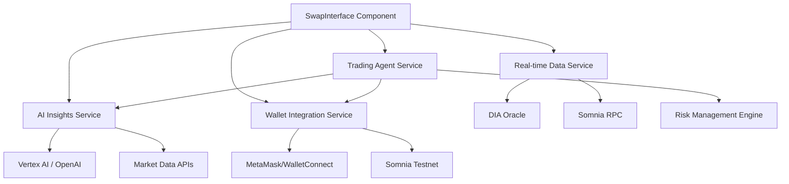

# Design Document

## Overview

The AI-Enhanced Swap Interface transforms the existing basic swap component into an intelligent DeFi trading platform that leverages artificial intelligence for market analysis, predictive insights, and autonomous trading capabilities. The design maintains the current clean UI foundation while adding sophisticated AI integration, real-time data feeds, and advanced trading features.

## Architecture

### High-Level Architecture



### Component Architecture

The enhanced swap interface follows an extended atomic design pattern:

```
SwapInterface (Enhanced Organism)
├── AIInsightsPanel (New Molecule)
│   ├── PredictionCard (New Atom)
│   ├── RiskIndicator (New Atom)
│   └── ConfidenceScore (New Atom)
├── SwapForm (Enhanced Molecule)
│   ├── TokenSelector (Enhanced Atom)
│   ├── AmountInput (Enhanced Atom)
│   └── SlippageSettings (New Atom)
├── TransactionDetails (Enhanced Molecule)
│   ├── PriceImpactChart (New Atom)
│   ├── GasOptimizer (New Atom)
│   └── CrossChainBridge (New Atom)
├── AgentControls (New Molecule)
│   ├── AgentToggle (New Atom)
│   ├── StrategySelector (New Atom)
│   └── PerformanceMetrics (New Atom)
└── NotificationSystem (New Molecule)
    ├── ToastProvider (New Atom)
    └── RiskWarnings (New Atom)
```

## Components and Interfaces

### 1. AI Insights Service

**Purpose**: Provides real-time market analysis and predictions

**Interface**:
```typescript
interface AIInsightsService {
  getPrediction(tokenPair: TokenPair): Promise<MarketPrediction>
  getMarketSentiment(token: Token): Promise<SentimentAnalysis>
  getRiskAssessment(swapParams: SwapParameters): Promise<RiskScore>
  subscribeToUpdates(callback: (update: AIUpdate) => void): Subscription
}

interface MarketPrediction {
  direction: 'bullish' | 'bearish' | 'neutral'
  confidence: number // 0-100
  timeframe: string
  rationale: string[]
  expectedPriceChange: number
  riskLevel: 'low' | 'medium' | 'high'
}
```

**Implementation Strategy**:
- Integrate with Vertex AI or OpenAI for market analysis
- Use DIA Oracle and CoinGecko for real-time market data
- Implement caching with 30-second refresh intervals
- Provide fallback to historical data if AI service is unavailable

### 2. Real-time Data Service

**Purpose**: Fetches live on-chain data and market information

**Interface**:
```typescript
interface DataService {
  getTokenPrice(token: Token, chain: Chain): Promise<TokenPrice>
  getLiquidity(tokenPair: TokenPair): Promise<LiquidityData>
  getGasEstimate(transaction: SwapTransaction): Promise<GasEstimate>
  subscribeToPrice(token: Token, callback: (price: TokenPrice) => void): Subscription
}

interface TokenPrice {
  price: number
  priceUSD: number
  change24h: number
  volume24h: number
  lastUpdated: Date
}
```

**Implementation Strategy**:
- Use ethers.js for Somnia testnet integration
- Implement WebSocket connections for real-time price feeds
- Add retry logic with exponential backoff
- Cache frequently accessed data with Redis or local storage

### 3. Enhanced Swap Form

**Purpose**: Provides advanced trading controls and validation

**Key Features**:
- **Slippage Settings**: Configurable tolerance (0.1% - 5%)
- **Price Impact Visualization**: Real-time chart showing impact
- **Gas Optimization**: Suggests optimal timing and routes
- **Cross-chain Support**: Bridge integration for multi-chain swaps

**State Management**:
```typescript
interface SwapFormState {
  fromToken: Token | null
  toToken: Token | null
  fromAmount: string
  toAmount: string
  slippage: number
  gasPrice: 'slow' | 'standard' | 'fast'
  crossChain: boolean
  aiRecommendations: MarketPrediction[]
}
```

### 4. Trading Agent Integration

**Purpose**: Enables autonomous trading based on AI predictions

**Interface**:
```typescript
interface TradingAgent {
  isActive: boolean
  strategy: TradingStrategy
  performance: PerformanceMetrics
  
  enable(strategy: TradingStrategy): Promise<void>
  disable(): Promise<void>
  executeSwap(params: SwapParameters): Promise<TransactionResult>
  getPerformance(): PerformanceMetrics
}

interface TradingStrategy {
  riskTolerance: 'conservative' | 'moderate' | 'aggressive'
  maxSlippage: number
  stopLoss: number
  takeProfit: number
  rebalanceThreshold: number
}
```

## Data Models

### Core Models

```typescript
interface Token {
  address: string
  symbol: string
  name: string
  decimals: number
  logoURI: string
  chainId: number
  verified: boolean
  auditStatus?: 'audited' | 'unaudited' | 'warning'
}

interface SwapParameters {
  fromToken: Token
  toToken: Token
  amount: string
  slippage: number
  recipient?: string
  deadline?: number
}

interface TransactionResult {
  hash: string
  status: 'pending' | 'confirmed' | 'failed'
  gasUsed?: number
  effectivePrice?: number
  timestamp: Date
}
```

### AI-Specific Models

```typescript
interface AIUpdate {
  type: 'prediction' | 'risk' | 'opportunity'
  severity: 'info' | 'warning' | 'critical'
  message: string
  data: any
  timestamp: Date
}

interface RiskScore {
  overall: number // 0-100
  factors: {
    volatility: number
    liquidity: number
    smartContract: number
    market: number
  }
  recommendations: string[]
}
```

## Error Handling

### Error Categories and Responses

1. **Network Errors**
   - Display retry button with exponential backoff
   - Show offline indicator when connection is lost
   - Cache last known prices for basic functionality

2. **AI Service Errors**
   - Gracefully degrade to basic swap functionality
   - Show "AI insights unavailable" message
   - Provide manual risk assessment tools

3. **Transaction Errors**
   - Parse and display user-friendly error messages
   - Suggest solutions (increase gas, check balance, etc.)
   - Provide transaction troubleshooting guide

4. **Validation Errors**
   - Real-time form validation with clear error messages
   - Prevent invalid transactions before submission
   - Guide users through correction steps

### Error Recovery Strategies

```typescript
interface ErrorHandler {
  handleNetworkError(error: NetworkError): RecoveryAction
  handleAIServiceError(error: AIError): RecoveryAction
  handleTransactionError(error: TransactionError): RecoveryAction
}

type RecoveryAction = 
  | { type: 'retry'; delay: number }
  | { type: 'fallback'; alternative: string }
  | { type: 'manual'; instructions: string[] }
```

## Testing Strategy

### Unit Testing
- **AI Service Integration**: Mock AI responses and test prediction parsing
- **Data Service**: Test price fetching and WebSocket connections
- **Form Validation**: Comprehensive input validation scenarios
- **Agent Logic**: Test trading strategy execution and risk management

### Integration Testing
- **End-to-End Swap Flow**: Complete swap from token selection to confirmation
- **Cross-Chain Functionality**: Test bridge integration and multi-chain swaps
- **AI Recommendations**: Verify AI insights display correctly
- **Agent Trading**: Test autonomous trading with various market conditions

### Performance Testing
- **Real-time Updates**: Ensure smooth UI updates with live data
- **Mobile Responsiveness**: Test on various device sizes and orientations
- **Load Testing**: Verify performance under high user load
- **Network Resilience**: Test behavior with poor network conditions

### Accessibility Testing
- **Screen Reader Compatibility**: Test with NVDA, JAWS, and VoiceOver
- **Keyboard Navigation**: Ensure all features accessible via keyboard
- **Color Contrast**: Verify WCAG 2.1 AA compliance
- **Focus Management**: Test focus indicators and tab order

## Security Considerations

### Smart Contract Interactions
- Implement transaction simulation before execution
- Verify contract addresses against known registries
- Add slippage protection and deadline enforcement
- Use multicall for batch operations when possible

### AI Integration Security
- Validate all AI responses before displaying to users
- Implement rate limiting for AI service calls
- Sanitize AI-generated content to prevent XSS
- Add circuit breakers for AI service failures

### User Data Protection
- Never store private keys or sensitive wallet information
- Encrypt local storage data
- Implement proper session management
- Add audit logging for agent actions

## Mobile and Responsive Design

### Breakpoint Strategy
- **Mobile (< 768px)**: Single column layout, collapsible sections
- **Tablet (768px - 1024px)**: Optimized two-column layout
- **Desktop (> 1024px)**: Full feature display with sidebars

### Mobile-Specific Features
- **Touch Optimization**: Larger touch targets (44px minimum)
- **Gesture Support**: Swipe to switch token positions
- **Haptic Feedback**: Vibration for important actions
- **Offline Mode**: Basic functionality when network is poor

### Progressive Enhancement
- Core swap functionality works without JavaScript
- Enhanced features load progressively
- Graceful degradation for older browsers
- Service worker for offline capabilities